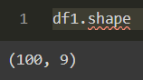

# Ex-01_DS_Data_Cleansing
# AIM
To read the given data and perform data cleaning and save the cleaned data to a file.

# Explanation
Data cleaning is the process of preparing data for analysis by removing or modifying data that is incorrect ,incompleted , irrelevant , duplicated or improperly formatted. Data cleaning is not simply about erasing data ,but rather finding a way to maximize datasets accuracy without necessarily deleting the information.

# ALGORITHM
## STEP 1
Read the given Data

## STEP 2
Get the information about the data

## STEP 3
Remove the null values from the data

## STEP 4
Save the Clean data to the file

# CODE
```
import pandas as pd
import numpy as np
import seaborn as sns

df = pd.read_csv("C:\Users\chief\OneDrive\Documents\Ex-01-Data-Cleaning\Data_set.csv")
df

df.head()

df.describe()

df.info()

df.tail()

df.shape

df.columns

df.isnull().sum()

df.duplicated()

df['show_name'] = df['show_name'].fillna(df['show_name'].mode()[0])
df['aired_on'] = df['aired_on'].fillna(df['aired_on'].mode()[0])
df['original_network'] = df['original_network'].fillna(df['original_network'].mode()[0])

sns.boxplot(x="rating",data=df)

df['rating'] = df['rating'].fillna(df['rating'].mean())
df['current_overall_rank'] = df['current_overall_rank'].fillna(df['current_overall_rank'].mean())
df['watchers'] = df['watchers'].fillna(df['watchers'].mean())

df.isnull().sum()

df.info()
```
# OUPUT
## Dataset:

## Head:

## Describe:

## Info:

## Tail:

## Shape:

## isnull().sum() - Pre Cleaning:

## Duplicates:

## SNS Plot - Rating:

## isnull().sum() - Post Cleaning:

## Info - Post Cleaning:


# RESULT
The given data is read and data cleaning is performed and the cleaned data is saved to a file.
